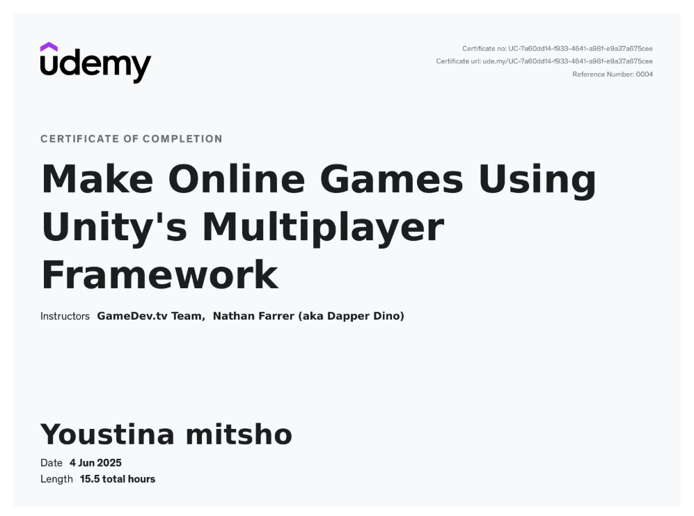

# 🚀 TANKERS: Multiplayer Battle 🔥

Welcome to **TANKERS**, a fast-paced 2D multiplayer tank shooter where strategy, reflexes, and movement collide!

Built in Unity using modern multiplayer tools, TANKERS puts you in control of a deadly tank on a mission to dominate the arena, collect bounty coins, survive enemy fire, and top the leaderboard.

---

## 🧠 Key Features

- 🎮 **Multiplayer Action** – Seamless real-time matches using Unity Relay and Matchmaker (Client Hosting).
- 💥 **Tank Combat** – Smooth movement and shooting mechanics.
- ⚰️ **Auto Respawn** – Die? No worries. You’ll auto-respawn and dive right back into the battle!
- 🧭 **Minimap System** – Never lose track of enemy positions or healing zones.
- ❤️ **Healing Zones** – Take cover, recover, and return to the fight.
- 💰 **Bounty Coins** – Eliminate enemies to earn coins and rise in rank.
- 🏆 **Leaderboard** – Compete with others and claim your place at the top.
- ⏳ **Flickering Timer** – When time is running low, the intensity rises!

---

## 🛠️ Built With

- **Unity 2022.3.58f1**
- **Unity Netcode for GameObjects**
- **Unity Relay & Matchmaker**
- **TextMeshPro (TMP)**
- **C#** scripting with clean architecture

---

## 📸 Gameplay Sneak Peek

> 🔽 Click to watch the demo gameplay!  
[](https://youtu.be/n7xuWa_hQbQ)

---

## 🚀 Getting Started

> You can either:
- 🧪 **Download the build** from [Releases](https://github.com/YoustinaMitsho/Tankers/releases/tag/v1.0)
- 💻 Or **clone the repo** and run it in Unity

```bash
git clone https://github.com/YoustinaMitsho/Tankers.git
```

## 🙋 Why I Made This
As part of my journey in multiplayer game development, I wanted to explore:

- Realtime networking in Unity
- Game state syncing
- Hosting architecture
- UI/UX dynamics for fast-paced games

This game is the result of weeks of learning, building, debugging, and above all — playing!


## 🎓 Special Thanks & Course Credits
This game was initially created by following the awesome Udemy course:

📘 [**Multiplayer Game Development with Unity and Netcode**](https://www.udemy.com/course/unity-multiplayer-netcode/?couponCode=MT150725B)
by **GameDev.tv** and **Nathan Farrer (aka Dapper Dino)**.

The course taught me how to:
- Build real-time multiplayer games using Unity’s Netcode for GameObjects
- Use Unity Lobby, Relay, and Matchmaker to handle online connections
- Sync player movement, actions, and UI across clients

🧾 **Certificate of Completion:**  
 

---

## ✨ My Custom Modifications

After finishing the course, I extended the game to better match my creative vision:

- 🎨 Improved UI and added polish to the Victory screen
- 💥 Adjusted bullet visuals and hit feedback
- 🎵 Added Background Music and soundeffects
- 🏁 Enhanced the leaderboard and victory conditions

---


## 🙌 Let's Connect
Love the game? Want to collab, give feedback, or discuss Unity development?

📬 youstinamitcho@gmail.com

🔗 [LinkedIn](https://www.linkedin.com/in/youstina-mitcho)


🎮 Built with 💙 by Youstina Mitsho
